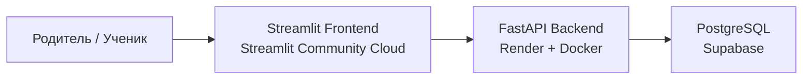
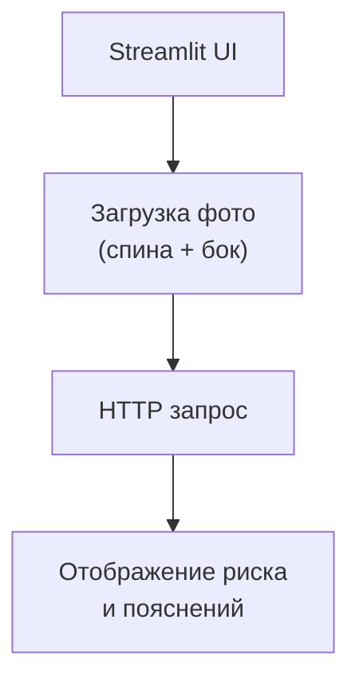
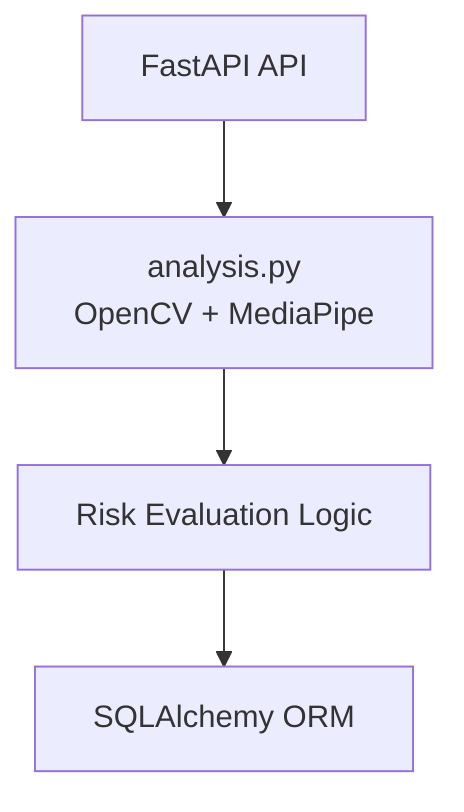
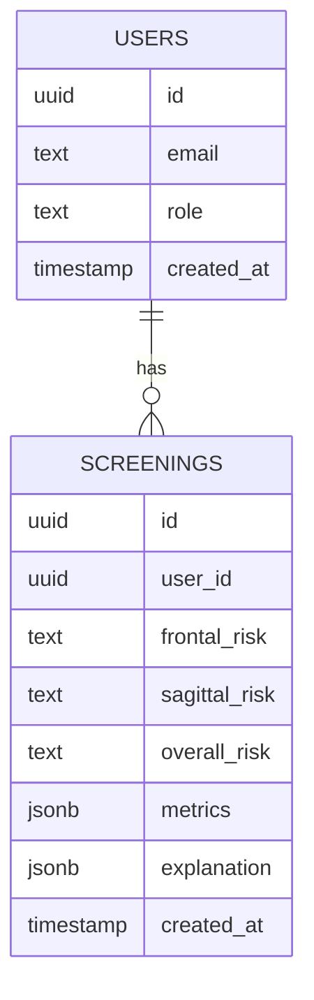
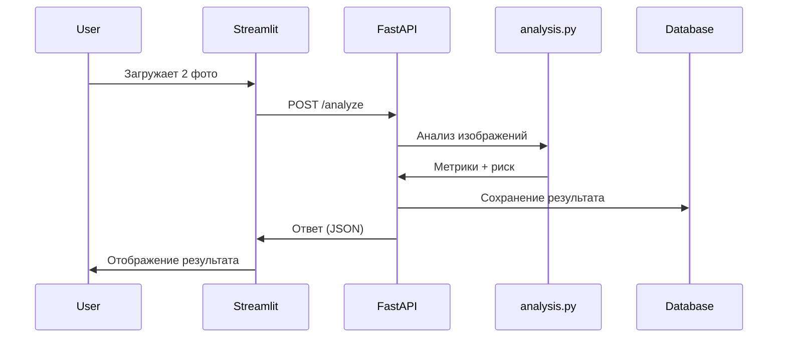

# 🧍‍♂️ Spine Deviation Check App (MVP)

**Spine Deviation Check App** — это **full-stack web-приложение для удалённого предварительного ориентировочного скрининга состояния позвоночника у детей** на основе анализа фотографий **со спины и сбоку**.

> ⚠️ **ВАЖНО**  
> Приложение **НЕ является медицинским диагностическим инструментом**.  
> Оно предназначено для **оценки потенциального риска**  
> (**низкий / средний / высокий**) и **принятия решения о необходимости дальнейшего медицинского обследования**.

---

## 🎯 Назначение проекта

Проект разрабатывается для использования в учреждении:

**УО  
«Могилёвская государственная санаторная школа-интернат  
для детей, больных сколиозом»**  
🔗 https://mgsshi.by/

### Основные цели:
- обеспечить **дистанционный предварительный скрининг** состояния позвоночника ребёнка;
- **снизить нагрузку** на врачей-ортопедов;
- дать родителям и педагогам **ранний ориентир риска**;
- при необходимости — **направить ребёнка на полноценное медицинское обследование**.

---

## 🌐 Онлайн-доступ

- 🎨 **Frontend (Streamlit):**  
  https://spine-deviation-check.streamlit.app/

- 🧠 **Backend API (FastAPI):**  
  развернут в облаке (Render)

- 🗄️ **Database (PostgreSQL):**  
  Supabase

---

## 🧱 Архитектура проекта (Full-Stack)

### Общая схема (Cloud-Native)

---

🧩 **Архитектура по компонентам**

🎨 **Frontend (Streamlit)**

🧠 **Backend (FastAPI / Render)**

🗄️ **Database (PostgreSQL / Supabase)**

---

🔄 **Flow работы приложения**

---

🛠️ **Технологический стек**

🐍 **Backend**

Python 3.11

FastAPI — REST API

OpenCV — обработка изображений

MediaPipe Pose — детекция ключевых точек тела

SQLAlchemy — ORM

Alembic — миграции БД

Docker — production-деплой

---

🎨 **Frontend**

Streamlit

HTTP-интеграция с backend

Responsive UI

---

🗄️ **Database**

PostgreSQL

Supabase (managed cloud DB)

---

🧠 **Ключевая логика — analysis.py**

Файл analysis.py — сердце приложения.
Он отвечает за обработку изображений и первичную оценку состояния позвоночника.

Использование OpenCV

декодирование изображений (cv2.imdecode);

конвертация цветовых пространств (BGR → RGB);

подготовка данных для MediaPipe.

Использование MediaPipe

Pose — детекция 33 ключевых точек тела;

анализ плеч, таза, головы и голеностопа.

📐 **Логика анализа**

1️⃣ Фронтальная плоскость (вид со спины)

Оцениваются:

асимметрия плеч;

асимметрия таза.

Метрика:

|y_left - y_right|

Интерпретация:

малая разница → низкий риск;

выраженная разница → повышенный риск.

2️⃣ Сагиттальная плоскость (вид сбоку)

Оцениваются:

положение головы относительно плеч;

наклон корпуса.

Текущая MVP-метрика:

|x_nose - x_shoulder|

⚠️ Используется координатная, а не угловая модель.

⚠️ Ограничения MVP (осознанно)

не измеряются реальные углы кифоза/лордоза;

не анализируется линия позвоночника;

отсутствует калибровка камеры;

результат намеренно консервативный.

---

🚀 **Пути развития проекта**
🔹 **Без нейросетей (Computer Vision)**

угловые метрики (ear–shoulder–hip);

анализ вертикальной оси тела;

нормализация под рост;

многоточечная оценка осанки.

🔹 **С нейросетями (ML / DL)**

CNN / Vision Transformers;

размеченная обучающая выборка;

регрессия углов позвоночника;

классификация степени риска.
---

🧩 **Возможные дополнительные фичи**

отправка фото врачу-ортопеду (EmailJS);

личный кабинет (auth / roles);

React-frontend;

аналитика истории обследований;

экспорт PDF-отчётов;

медицинская экспертная панель.

---

⚖️ **Медицинский дисклеймер**

**Результаты анализа являются предварительной ориентировочной оценкой
и не заменяют консультацию врача-ортопеда.**
---

🏁 **Статус проекта**

✅ MVP реализован

✅ Full-stack облачное приложение

🚧 Активное развитие

---

👨‍💻 **Автор**

Андрей Музарев
Python-разработчик / STEAM-педагог

GitHub: https://github.com/amuzarau 

Website: https://andreimuzarau.com/

⭐ Если вы врач, заинтересованный родитель, педагог или разработчик — обратная связь приветствуется! 
Свяжитесь со мной через форму в разделе Контакты моего веб-сайта **https://andreimuzarau.com/**
