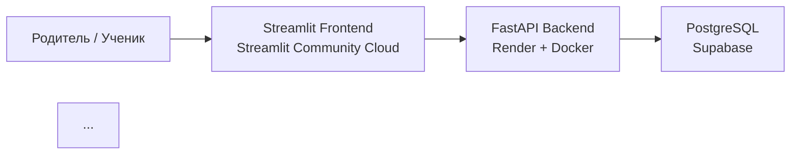

# 🧍‍♂️ Spine Deviation Check App (MVP)

**Spine Deviation Check App** — это **full-stack web-приложение для удалённого предварительного ориентировочного скрининга состояния позвоночника у детей** на основе анализа фотографий **со спины и сбоку**.

> ⚠️ **ВАЖНО**  
> Приложение **НЕ является медицинским диагностическим инструментом**.  
> Оно предназначено для **оценки потенциального риска**  
> (**низкий / средний / высокий**) и **принятия решения о необходимости дальнейшего медицинского обследования**.

---

## 🎯 Назначение проекта

Проект разрабатывается для использования в учреждении:

**УО  
«Могилёвская государственная санаторная школа-интернат  
для детей, больных сколиозом»**  
🔗 https://mgsshi.by/

### Основные цели:
- обеспечить **дистанционный предварительный скрининг** состояния позвоночника ребёнка;
- **снизить нагрузку** на врачей-ортопедов;
- дать родителям и педагогам **ранний ориентир риска**;
- при необходимости — **направить ребёнка на полноценное медицинское обследование**.

---

## 🌐 Онлайн-доступ

- 🎨 **Frontend (Streamlit):**  
  https://spine-deviation-check.streamlit.app/

- 🧠 **Backend API (FastAPI):**  
  развернут в облаке (Render)

- 🗄️ **Database (PostgreSQL):**  
  Supabase

---

## 🧱 Архитектура проекта (Full-Stack)

### Общая схема (Cloud-Native)

